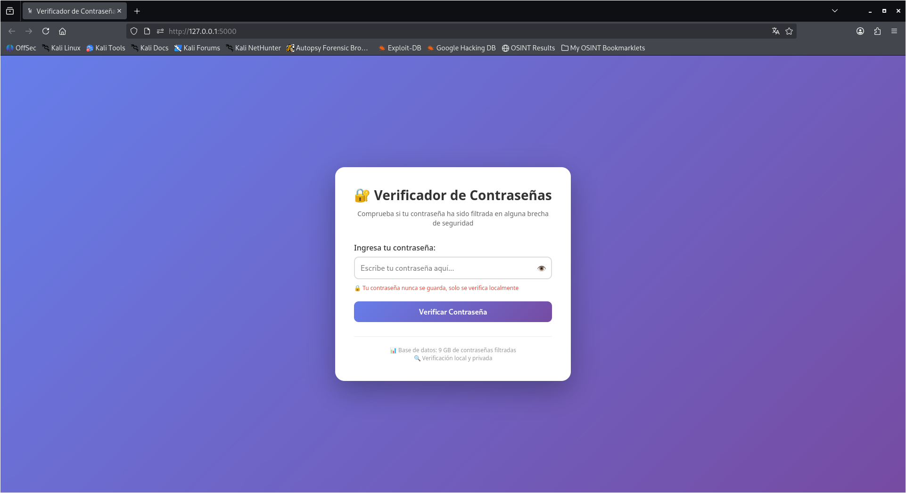
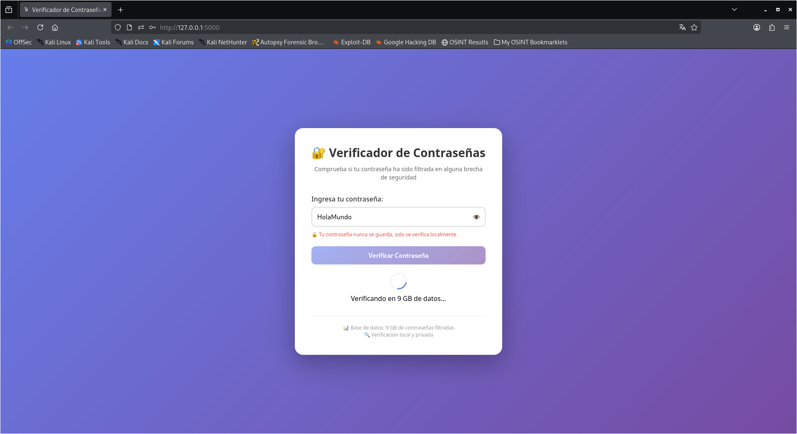
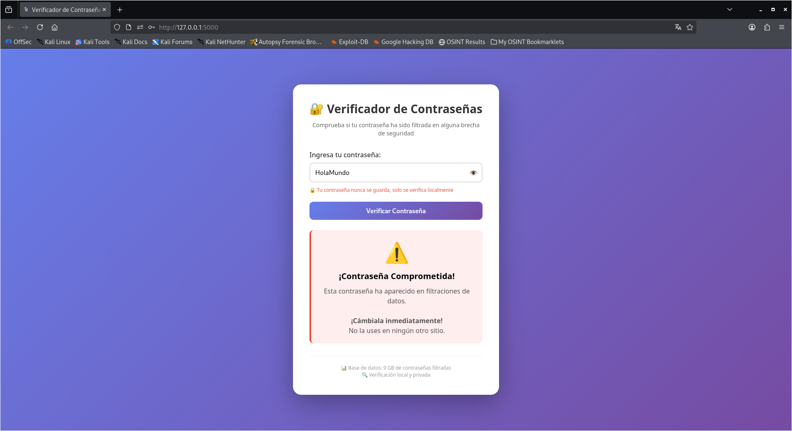

<h1 align="center">Password Checker 🔒</h1>

<p align="center">
  <strong>Offline password breach checker</strong> to verify if your password has been compromised in any data breach 🕵🏽‍♂️
</p>

<p align="center">
  
</p>

<p align="center">
  
  
  
  
</p>

---

## 🚀 Features

- 🔐 **Offline Verification:** No external APIs, no internet required after setup.
- 🛡️ **Privacy First:** Your password never leaves your browser or local machine.
- 📚 **9GB Breach Database:** Checks against millions of compromised passwords.
- 🎨 **Clean Web Interface:** User-friendly design with instant results.
- ⚡ **Fast Lookups:** Optimized binary search on sorted password hashes.
- 🔒 **SHA-1 Hashing:** Passwords are hashed locally before checking.
- 💻 **Lightweight:** Runs on any system with Python installed.

## 📌 Prerequisites

- Python 3.8+

- Required libraries: `Flask`

---

# 📦 Installation

```bash
git clone https://github.com/HackUnderway/password-checker.git
```
```bash
cd password-checker
```
```bash
pip install -r requirements.txt
```

# 💻 Usage

### Run the application:
```bash
python3 app.py
```
### Open your browser and navigate to:
http://127.0.0.1:5000

<p align="center">
  
</p>

<p align="center">
  
</p>

<p align="center">
  
</p>

## 🗄️ Database Setup (Important)

> [!IMPORTANT]
> The breach database is **NOT** included in this repository due to its size (9GB uncompressed).

This tool uses the famous **"Breach Compilation"** dataset – a collection of over 1.4 billion real-world leaked passwords.

### 📥 How to Obtain the Database

The database is available as a torrent (originally shared as a Gist by `ducnp`):

**Magnet Link:**
```bash
magnet:?xt=urn:btih:5a9ba318a5478769ddc7393f1e4ac928d9aa4a71&dn=breachcompilation.txt.7z
```

**File Details:**
| Format | Size |
|--------|------|
| Compressed (7z) | 4.1 GB |
| Uncompressed (TXT) | 9.0 GB |

### 🔧 Setup Instructions

1. **Download** using a torrent client (qBittorrent, Transmission, etc.)
2. **Extract** the `breachcompilation.txt` file from the 7z archive:

7z x breachcompilation.txt.7z

## ⚙️ How It Works (Technical)

1. **User submits password** via web form (HTTPS in production)
2. **Password is hashed** using SHA-1 on the server:
   ```python
   hash = hashlib.sha1(password.encode()).hexdigest().upper()
   ```

### How it works:
Enter any password in the input field

Click "Verify Password"

Get instant feedback:

✅ Safe - Password not found in breach database

❌ Compromised - Password appears in data breaches

> [!WARNING]
> ## Disclaimer
> This tool is intended for **educational and security awareness purposes only**.
> - Never enter real passwords on untrusted systems.
> - The developer is not responsible for any misuse.
> - Use at your own risk.

---

# 🧠 Notes

- The database file can be very large (9GB+). Ensure sufficient RAM/disk space.
- First load may take time depending on database size.
- For production use, consider pre-loading hashes into memory.
- This tool verifies offline - no data leaves your network.

> **The project is open to collaborators and partners.**

# 🧪 Supported Systems
|Distribution | Verified version | 	Supported | 	Status |
|--------------|--------------------|------|-------|
|Kali Linux| 2026.1| ✅| Working   |
|Parrot Security OS| 6.3| ✅ | Working   |
|Windows| 11 | ✅ | Working   |
|BackBox| 9 | ✅ | Working   |
|Arch Linux| 2024.12.01 | ✅ | Working   |

# Support
For questions, bug reports, or suggestions, please contact: info@hackunderway.com

# License
- [x] TokIntel is licensed.
- [x] See the [LICENSE](https://github.com/HackUnderway/TokIntel#MIT-1-ov-file) file for more information.

# 👨‍💻 Author

* [Victor Bancayan](https://www.offsec.com/bug-bounty-program/) - (**CEO at [Hack Underway](https://hackunderway.com/)**) 

## 🔗 Links
[](https://www.patreon.com/c/HackUnderway)
[](https://hackunderway.com)
[](https://www.facebook.com/HackUnderway)
[](https://www.youtube.com/@JeyZetaOficial)
[](https://x.com/JeyZetaOficial)
[](https://instagram.com/hackunderway)
[](https://tryhackme.com/p/JeyZeta)

## ☕️ Support the project

If you like this tool, consider buying me a coffee:

[](https://www.buymeacoffee.com/hackunderway)

## 🌞 Subscriptions

###### Subscribe to: [Jey Zeta](https://www.facebook.com/JeyZetaOficial/subscribe/)

[](https://www.kali.org/)

from  made in  with  by: <font color="red">Victor Bancayan</font>

© 2026
